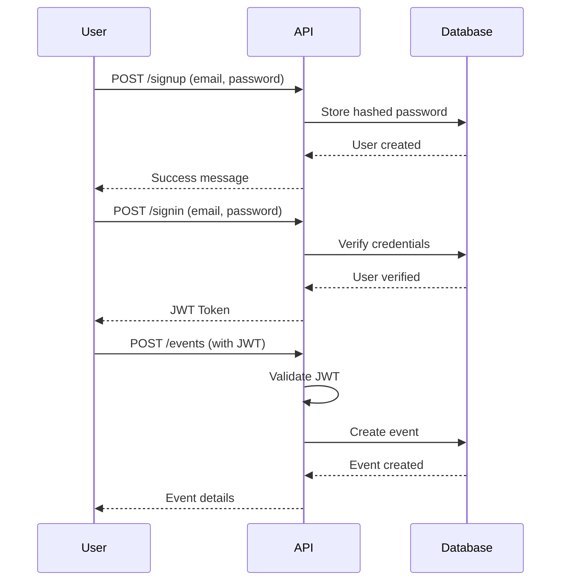

# 🎫 Event Booking REST API

A robust RESTful API for managing events and user registrations, built with **Go** and the **Gin** framework. Features complete CRUD operations, JWT authentication, and user event registration management.

[](https://go.dev/)
[](https://gin-gonic.com/)
[](LICENSE)

---

## 📋 Table of Contents

- [Features](#-features)
- [Tech Stack](#-tech-stack)
- [Project Structure](#-project-structure)
- [Getting Started](#-getting-started)
- [API Documentation](#-api-documentation)
    - [Authentication](#-authentication)
    - [Events](#-events)
    - [Event Registration](#-event-registration)
- [Request & Response Examples](#-request--response-examples)
- [Authentication Flow](#-authentication-flow)
- [License](#-license)

---

## ✨ Features

- ✅ **Full CRUD Operations** for events
- 🔐 **JWT-based Authentication** for secure access
- 👤 **User Management** (Signup & Login)
- 🎟️ **Event Registration** with user tracking
- 🚫 **Registration Cancellation** support
- 🗄️ **SQLite Database** for data persistence
- 🛡️ **Middleware Protection** for sensitive routes
- 📝 **RESTful API Design** following best practices

---

## 🛠️ Tech Stack

- **[Go](https://go.dev/)** - Backend programming language
- **[Gin](https://gin-gonic.com/)** - High-performance web framework
- **[SQLite](https://www.sqlite.org/)** - Lightweight database
- **[JWT](https://jwt.io/)** - JSON Web Tokens for authentication
- **bcrypt** - Password hashing

---

## 📁 Project Structure

```
EVENT-BOOKING/
│
├── apis/                          # HTTP request examples
│   ├── cancel-register.http
│   ├── create-event.http
│   ├── delete-event.http
│   ├── fetch-single-event.http
│   ├── get-events.http
│   ├── register-event.http
│   ├── signin.http
│   ├── signup.http
│   └── update-event.http
│
├── db/                            # Database configuration
│   └── db.go
│
├── middlewares/                   # Middleware functions
│   └── auth.go
│
├── models/                        # Data models
│   ├── event.go
│   └── user.go
│
├── routes/                        # Route handlers
│   ├── events.go
│   ├── registrations.go
│   ├── routes.go
│   └── user.go
│
├── utils/                         # Utility functions
│   ├── hash.go
│   └── jwt.go
│
├── api.db                         # SQLite database file
├── go.mod                         # Go module definition
├── go.sum                         # Dependency checksums
├── main.go                        # Application entry point
└── README.md                      # Project documentation
```

---

## 🚀 Getting Started

### Prerequisites

- **Go 1.21+** installed on your system
- **Git** for cloning the repository

### Installation

1. **Clone the repository**

    ```bash
    git clone https://github.com/mahmoudrabbas/A-Go-powered-Event-Booking-REST-API
    cd Event-Booking
    ```

2. **Install dependencies**

    ```bash
    go mod tidy
    ```

3. **Run the application**

    ```bash
    go run main.go
    ```

4. **Server will start on**
    ```
    http://localhost:8080
    ```

---

## 📡 API Documentation

### 🔐 Authentication

| Method | Endpoint  | Description                 | Auth Required |
| ------ | --------- | --------------------------- | ------------- |
| `POST` | `/signup` | Register a new user         | ❌            |
| `POST` | `/signin` | Login and receive JWT token | ❌            |

### 📅 Events

| Method   | Endpoint      | Description                | Auth Required |
| -------- | ------------- | -------------------------- | ------------- |
| `GET`    | `/events`     | Get all available events   | ❌            |
| `GET`    | `/events/:id` | Get a specific event by ID | ❌            |
| `POST`   | `/events`     | Create a new event         | ✅            |
| `PUT`    | `/events/:id` | Update an existing event   | ✅            |
| `DELETE` | `/events/:id` | Delete an event            | ✅            |

### 🎟️ Event Registration

| Method   | Endpoint               | Description                | Auth Required |
| -------- | ---------------------- | -------------------------- | ------------- |
| `POST`   | `/events/:id/register` | Register user for an event | ✅            |
| `DELETE` | `/events/:id/register` | Cancel event registration  | ✅            |

> **Note:** Routes marked with ✅ require a valid JWT token in the `Authorization` header.

---

## 📥 Request & Response Examples

### 1️⃣ User Signup

**Request:**

```http
POST /signup
Content-Type: application/json

{
  "email": "abbas1@gmail.com",
  "password": "12345"
}
```

**Response:**

```json
{
    "message": "User created successfully"
}
```

---

### 2️⃣ User Login

**Request:**

```http
POST /signin
Content-Type: application/json

{
  "email": "abbas1@gmail.com",
  "password": "12345"
}
```

**Response:**

```json
{
    "token": "eyJhbGciOiJIUzI1NiIsInR5cCI6IkpXVCJ9..."
}
```

---

### 3️⃣ Create Event (Protected)

**Request:**

```http
POST /events
Content-Type: application/json
Authorization: eyJhbGciOiJIUzI1NiIsInR5cCI6IkpXVCJ9...

{
  "name": "Event test",
  "description": "description test",
  "location": "Minya",
  "dateTime": "2026-04-02T15:30:00.000Z"
}
```

**Response:**

```json
{
    "event": {
        "id": 1,
        "name": "Event test",
        "description": "description test",
        "location": "Minya",
        "dateTime": "2026-04-02T15:30:00Z",
        "userId": 1
    }
}
```

---

### 4️⃣ Get All Events

**Request:**

```http
GET /events
```

**Response:**

```json
{
    "events": [
        {
            "id": 1,
            "name": "Event test",
            "description": "description test",
            "location": "Minya",
            "dateTime": "2026-04-02T15:30:00Z",
            "userId": 1
        }
    ]
}
```

---

### 5️⃣ Update Event (Protected)

**Request:**

```http
PUT /events/9
Content-Type: application/json
Authorization: eyJhbGciOiJIUzI1NiIsInR5cCI6IkpXVCJ9...

{
  "name": "Test (updated)",
  "description": "Description (updated)",
  "location": "Still Minya",
  "dateTime": "2026-04-02T15:30:00.000Z"
}
```

**Response:**

```json
{
    "message": "Event updated successfully"
}
```

---

### 6️⃣ Delete Event (Protected)

**Request:**

```http
DELETE /events/9
Authorization: eyJhbGciOiJIUzI1NiIsInR5cCI6IkpXVCJ9...
```

**Response:**

```json
{
    "message": "Event deleted successfully"
}
```

---

### 7️⃣ Register for Event (Protected)

**Request:**

```http
POST /events/1/register
Authorization: eyJhbGciOiJIUzI1NiIsInR5cCI6IkpXVCJ9...
```

**Response:**

```json
{
    "message": "Successfully registered"
}
```

---

### 8️⃣ Cancel Registration (Protected)

**Request:**

```http
DELETE /events/1/register
Authorization: eyJhbGciOiJIUzI1NiIsInR5cCI6IkpXVCJ9...
```

**Response:**

```json
{
    "message": "Registration cancelled successfully"
}
```

---

## 🔐 Authentication Flow



---

## 📝 Important Notes

- **All protected routes require JWT authentication** via the `Authorization` header
- **Token format:** `Authorization: <your_jwt_token>` (no "Bearer" prefix)
- **All requests and responses use JSON format**
- **Event IDs are passed as URL parameters** (`:id`)
- **Passwords are hashed using bcrypt** before storage
- **SQLite database file** (`api.db`) is created automatically on first run

---

## 🔮 Future Enhancements

- [ ] Add event categories and filtering
- [ ] Implement pagination for event listings
- [ ] Add event search functionality
- [ ] Include email notifications for registrations
- [ ] Add event capacity limits
- [ ] Implement user profile management
- [ ] Add event images/thumbnails
- [ ] Create admin dashboard

---

## 📄 License

This project is created for **learning purposes** and practice with **Go** and **backend development**.

---

## 👨‍💻 Author

**mahmoudrabbas**

- GitHub: [@mahmoudrabbas](https://github.com/mahmoudrabbas)

---

## 🤝 Contributing

Contributions, issues, and feature requests are welcome! Feel free to check the [issues page](https://github.com/mahmoudrabbas/Event-Booking/issues).

---

## ⭐ Show your support

Give a ⭐️ if this project helped you learn Go and backend development!

---

<div align="center">
  <strong>Built with ❤️ using Go and Gin</strong>
</div>
